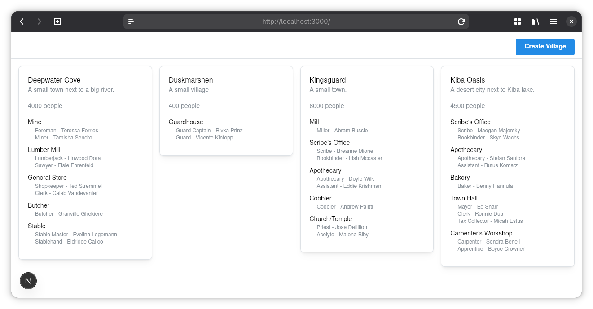

This is a small learning project to refresh React and TypeScript and get to know Prisma ORM.

It generates random villages from source data by assigning features (buildings, etc.) and assigning named people to positions within the features.



## Purpose of the project

This project is meant to be a learning project for myself to refresh my knowledge of React and TypeScript. It is not meant to be a production-ready project.

Focus areas:

- React
- TypeScript
- Prisma ORM
- Mantine UI

## Run in docker

A Dockerfile is provided to build a docker image with the project, as well as a docker-compose file.

To run the project in docker with a default postgres database, run:

```bash
docker-compose up
```

## Run locally

### Prerequisites

- Node.js 16+
- An empty existing PostgreSQL database with a user

### Installation

1. Install dependencies: `npm install`
2. Create a `.env` file in the root of the project with the following content: `DATABASE_URL=postgresql://<user>:<password>@<host>:<port>/<database>`
3. Apply migrations: `npx prisma migrate dev`
4. Seed the database: `npx prisma db seed`
5. Start the server: `npm run dev`

The server should now be running at http://localhost:3000.

